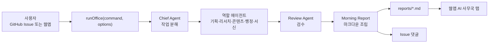

# AI 사무국 구현 청사진

이 문서는 파책남 AI 사무국(Personal Automation Agent System)을 `planning-copilot`에 단계적으로 붙이기 위한 Phase 0 산출물이다. 현재 단계에서는 기능 코딩을 하지 않고, 기존 앱 구조를 분석한 뒤 Phase 1 이후 구현 기준을 확정한다.

## 1. 제품 목표 요약

AI 사무국은 사용자가 GitHub Issue나 웹앱에 명령 한 줄을 입력하면, 역할이 분리된 에이전트 팀이 업무를 나누고 초안을 만든 뒤 검수된 아침 보고서를 남기는 개인 자동화 사무국이다.

핵심 결과물은 세 가지다.

- Issue 댓글: 짧은 진행 결과와 아침 보고서 요약
- `reports/`: 날짜와 명령별 마크다운 보고서
- 웹앱 `AI 사무국` 탭: 명령 시뮬레이션, 작업 분해, 에이전트별 초안, 저장된 보고서 열람

Phase 1은 API 키 없이 결정적인 템플릿 기반 시뮬레이션으로 구현한다. Phase 2 이후 GitHub Actions에서 같은 로직을 호출하고, Phase 3에서 `ANTHROPIC_API_KEY`가 있을 때만 LLM 모드를 활성화한다.

## 2. 현재 코드베이스 분석

현재 앱은 Vite, React 19, TypeScript 기반의 클라이언트 전용 웹앱이다. 주요 구조는 다음과 같다.

- `src/App.tsx`: 전체 화면, 좌측 내비게이션, 15개 섹션 렌더링, 복사/다운로드/백업 액션을 한 파일에서 관리한다.
- `src/types.ts`: `SectionId`, `ProjectData`, `KnowledgeDoc`, `ArchiveData`, `emptyProject`, `textFields`를 정의한다.
- `src/lib/*`: 공고 분석, 초안 생성, 파일 텍스트 추출, 저장, 프롬프트 조립, Mermaid 시각화를 담당한다.
- `assets/styles.css`: 앱 전체 스타일. `index.html`에서 직접 로드한다.
- `.github/workflows/deploy-pages.yml`: `master` push와 수동 실행 시 GitHub Pages 배포를 수행한다.
- `package.json`: `npm run check`가 `tsc --noEmit && vite build && node --check scripts/google-sheets-agent.mjs`를 실행한다.

현재 섹션은 `SectionId`와 `navItems`가 1:1로 연결되어 있으며, 15개 기존 기능은 `notice`부터 `draft`까지 유지된다. AI 사무국 탭은 새 `SectionId`를 추가하고 `navItems` 앞쪽에 넣는 방식이 가장 작고 안전하다.

## 3. 목표 아키텍처



공유 로직은 `src/lib/agentOffice.ts`에 둔다. 브라우저에서는 수동 시뮬레이션 UI가 같은 함수를 호출하고, GitHub Actions에서는 Node 스크립트가 같은 함수를 호출한다. 에이전트 역할 정의는 `src/data/agentRoles.ts`에 두어 앱과 스크립트가 공유한다.

## 4. Phase 1 구현 계획: 웹앱 시뮬레이션 MVP

Phase 1의 목표는 기존 15개 사업계획서 섹션을 유지하면서 웹앱 안에서 AI 사무국을 시뮬레이션하는 것이다. 외부 API 호출과 신규 의존성은 추가하지 않는다.

### 4.1 타입 추가

`src/types.ts`에 다음 타입을 추가한다.

- `AgentId`
- `AgentRole`
- `AgentTask`
- `AgentDraft`
- `MorningReport`
- `OfficeResult`

`SectionId`에는 `"agentOffice"`를 추가한다. 기존 `ProjectData`에는 AI 사무국 결과를 섞지 않고, 새 탭의 상태는 `App.tsx` 내부 상태나 별도 localStorage 키로 분리한다. 이렇게 하면 사업계획서 백업 JSON과 사무국 보고서 구조가 서로 꼬이지 않는다.

### 4.2 에이전트 매니페스트

`src/data/agentRoles.ts`를 만들고 7개 역할을 정의한다.

- `chief`: 비서실장, 명령 해석과 작업 분해
- `local-planning`: 기획 담당, 센터 사업과 지역 활동 기획
- `research`: 리서치 담당, 사례와 출처 정리
- `content`: 콘텐츠 담당, 블로그/쓰레드/인스타 초안
- `admin-doc`: 행정문서 담당, 공문서 구조 초안
- `email-draft`: 서신 담당, 이메일/메시지 초안
- `review`: 검수 담당, 누락과 모순 점검

각 매니페스트는 `id`, `name`, `role`, `goal`, `constraints`, `outputFormat`, `promptTemplate`, `triggerConditions`를 가진다. `triggerConditions`는 PRD 타입 예시에는 없지만 요구사항 본문에 포함되어 있으므로 타입에도 반영하는 편이 좋다.

### 4.3 에이전트 엔진

`src/lib/agentOffice.ts`를 만들고 아래 공개 함수를 제공한다.

- `runOffice(command, options)`: 전체 파이프라인 실행
- `callLLM(prompt, options)`: Phase 1에서는 항상 시뮬레이션 결과를 반환하는 스텁
- `createReportMarkdown(result)`: 보고서 마크다운 조립
- `slugifyCommand(command)`: Phase 2 보고서 파일명에도 재사용할 명령 슬러그 생성

결정적 출력을 위해 `Math.random()`, 실행 시점에 따라 바뀌는 템플릿 선택, 브라우저 locale 의존 포맷은 피한다. `createdAt`은 옵션으로 주입 가능하게 하고, 기본값만 `new Date().toISOString()`을 사용한다.

초안 템플릿은 실무에서 바로 다듬을 수 있도록 한국어 문단으로 작성한다.

- 기획: 목적, 대상, 일정, 예산 골격, 운영 리스크
- 리서치: 확인할 키워드, 참고 사례 유형, 출처 링크 자리
- 콘텐츠: 채널별 제목과 본문 초안, `#파책남` 해시태그
- 행정문서: 제목, 추진배경, 주요내용, 협조요청, `~함/~임` 어미
- 서신: 수신자별 제목과 본문, 자동 발송 금지 문구
- 검수: 누락, 모순, 민감정보 위험, 수정 제안

### 4.4 웹앱 탭

`src/App.tsx`에 `agentOffice` 섹션을 추가한다. `navItems`에서는 `notice` 앞이나 바로 뒤에 배치한다. 권장 배치는 첫 번째다.

새 탭에서 제공할 요소는 다음과 같다.

- 명령 입력 textarea
- `사무국 실행` 버튼
- 작업 분해표
- 참여 에이전트 목록
- 에이전트별 초안
- 아침 보고서 마크다운 미리보기
- 보고서 복사 버튼

Phase 1에서는 보고서 열람 API를 붙이지 않는다. 보고서 열람은 Phase 2에서 `reports/`가 실제로 생긴 뒤 GitHub Contents API로 구현한다.

### 4.5 스타일

`assets/styles.css`의 기존 패턴을 유지한다.

- 화면은 기존 `Panel`, `coach-bar`, `form-grid`, `draft-actions` 계열과 어울리게 구성한다.
- 새 탭 안에 큰 랜딩 페이지를 만들지 않는다.
- 보고서와 초안은 복사하기 쉬운 `textarea` 또는 읽기 전용 마크다운 블록으로 둔다.
- 색상은 기존 `--accent`, `--warm`, `--gold`, `--surface` 토큰 안에서 사용한다.

## 5. Phase 2 구현 계획: GitHub Actions 백그라운드 파이프라인

Phase 2는 GitHub Issue를 명령 큐로 쓰는 단계다. 시뮬레이션 모드만으로 항상 성공해야 하며, 추가 시크릿은 필요하지 않아야 한다.

### 5.1 워크플로우

`.github/workflows/agent-office.yml`을 추가한다.

트리거:

- `issues` 이벤트의 `opened`, `labeled`
- `workflow_dispatch` 수동 실행

조건:

- Issue에 `agent-task` 라벨이 있을 때 실행
- 제목이 `[명령]`으로 시작하면 제목에서 명령을 우선 파싱
- 아니면 본문 첫 문단을 명령으로 사용

권한:

```yaml
permissions:
  contents: write
  issues: write
```

안전장치:

- `timeout-minutes: 15`
- `concurrency.group: agent-office-${{ github.event.issue.number || github.run_id }}`
- `cancel-in-progress: false`

### 5.2 Node 오케스트레이터

`scripts/agent-office/run.mjs`를 추가한다. 브라우저용 TypeScript 로직을 Node에서 재사용해야 하므로, Phase 2 전에 빌드 산출물 전략을 정해야 한다.

권장안:

1. `npm run build:agent-office` 없이 `tsx`, `ts-node` 같은 새 의존성을 추가하지 않는다.
2. `tsc`가 기존 설정으로 `src/lib/agentOffice.ts`를 타입 체크하고, Actions 스크립트는 JS로 작성된 얇은 실행기만 둔다.
3. 공유 로직을 Node에서 직접 import해야 한다면 `scripts/agent-office` 아래에 빌드용 `tsconfig.agent-office.json`을 추가해 `src/lib/agentOffice.ts`와 `src/data/agentRoles.ts`만 `dist-agent-office/`로 컴파일한다.

P0의 신규 외부 의존성 0개 요구를 지키려면 3번이 가장 안전하다.

### 5.3 보고서 커밋

보고서는 `reports/YYYY-MM-DD-<slug>.md`에 저장한다. 파일 상단에는 front matter를 둔다.

```yaml
---
command: "사용자 명령"
createdAt: "2026-06-12T00:00:00.000Z"
agents:
  - chief
  - local-planning
mode: simulation
visibility: public
---
```

보고서 본문 첫머리에는 공개 저장소 주의를 넣는다.

> 공개 저장소 주의: 이 보고서는 public repository에 커밋됩니다. 개인 연락처, 내부 예산 실수치, 미공개 사업정보를 입력하지 마세요.

커밋 작성자는 GitHub Actions 기본 봇을 사용한다. 커밋 메시지는 `Add agent office report for issue #N` 형식으로 한다.

### 5.4 Issue 댓글

`GITHUB_TOKEN`으로 Issue 댓글을 남긴다. 댓글은 전체 보고서를 길게 붙이기보다 다음만 포함한다.

- 명령
- 핵심 3가지
- 참여 에이전트
- 다음 행동 체크리스트
- 커밋된 `reports/` 파일 경로

## 6. Phase 3 구현 계획: LLM 모드

`ANTHROPIC_API_KEY`가 있을 때만 LLM 모드를 사용한다. 키가 없거나 호출이 실패하면 시뮬레이션 모드로 폴백한다.

필수 규칙:

- API 키는 코드, 문서, 커밋에 포함하지 않는다.
- `callLLM` 내부에서 호출 횟수 상한을 강제한다.
- 기본 호출 상한은 10회다.
- `max_tokens` 상한을 둔다.
- 에이전트별 호출은 기본 1회, 반려 후 재작성 1회까지만 허용한다.
- LLM 응답이 비어 있거나 파싱에 실패해도 보고서는 생성된다.

Phase 3에서는 Node Actions 환경에서만 실제 API 호출을 열고, 브라우저 빌드에는 API 키가 노출되지 않게 한다.

## 7. Phase 4 구현 계획: 정기 브리핑과 피드백 루프

Phase 4는 운영 자동화를 확장한다.

- 평일 오전 6시 KST: cron `0 21 * * 0-4`
- `/다시 [피드백]`: `issue_comment` 이벤트로 재실행
- 오너 전용 조건: `github.event.comment.user.login == 'okrangone98'`
- `office.config.json`: 정기 브리핑 키워드, 기본 모드, 호출 상한
- 주간 요약: 일요일에 한 주의 `reports/`를 모아 회고 보고서 생성

댓글 재실행은 비용 유발 위험이 있으므로 Phase 4 전에는 구현하지 않는다.

## 8. 보안과 운영 원칙

반드시 지킬 원칙은 다음과 같다.

- 자동 이메일 발송, SNS 게시, 일정 변경, 결제 등 외부 쓰기 작업은 구현하지 않는다.
- Email Draft Agent는 초안만 만든다.
- 모든 보고서에 public repository 경고를 넣는다.
- 민감정보 입력 금지 원칙을 UI와 문서에 노출한다.
- GitHub Actions 권한은 `contents: write`, `issues: write`로 제한한다.
- 동일 Issue 중복 실행은 concurrency로 막는다.
- LLM 키가 없어도 파이프라인은 성공해야 한다.

## 9. 검증 기준

Phase 1 완료 조건:

- `npm run check` 통과
- 기존 15개 섹션이 내비게이션에서 유지됨
- 새 `AI 사무국` 탭에서 명령 입력 후 결정적 결과가 렌더링됨
- 보고서 복사 버튼이 동작함
- 신규 외부 의존성 없음

Phase 2 완료 조건:

- `agent-task` 라벨이 붙은 테스트 Issue에서 워크플로우 실행
- `reports/`에 마크다운 파일 커밋
- Issue 댓글에 요약 게시
- `ANTHROPIC_API_KEY` 없이도 성공

Phase 3 완료 조건:

- 시크릿이 있을 때 LLM 모드 호출
- 시크릿이 없거나 실패할 때 시뮬레이션 폴백
- 호출 상한과 timeout이 강제됨

Phase 4 완료 조건:

- 평일 아침 브리핑 자동 생성
- 오너 댓글 `/다시` 재실행
- 주간 보고서 생성

## 10. 승인 게이트

이 문서가 승인되면 다음 작업은 Phase 1 브랜치에서 진행한다.

권장 브랜치:

```bash
feat/agent-office-phase-1
```

권장 PR 제목:

```text
Add AI Agent Office MVP - Phase 1
```

Phase 1에서는 다음 파일 변경만 허용하는 것을 기본 범위로 삼는다.

- `src/types.ts`
- `src/data/agentRoles.ts`
- `src/lib/agentOffice.ts`
- `src/App.tsx`
- `assets/styles.css`
- 필요 시 `README.md`의 짧은 안내

Phase 2 이후 파일은 별도 브랜치와 PR에서 다룬다.
