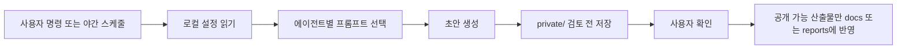

# 로컬 중심 자동화 운영 구조

이 문서는 AI 로컬기획 사무국을 안전하게 자동화하기 위한 저장 위치와 실행 구조를 정리한다.

## 1. 기본 원칙

자동화의 기본 원칙은 다음과 같다.

- GitHub에는 공개 가능한 코드, 문서, 프롬프트 템플릿만 저장한다.
- 로컬에는 민감정보, 계정정보, 실제 업무 원본, 검토 전 초안을 저장한다.
- Google Drive에는 원본 문서와 최종 산출물을 장기 보관한다.
- 외부 발송, 게시, 제출은 자동화하지 않고 초안까지만 만든다.

## 2. 저장 위치

### GitHub에 저장

```text
src/
docs/
prompts/agents/
automation/*.example.json
scripts/
```

용도:

- 앱 코드
- 에이전트 매니페스트
- 공개 가능한 프롬프트 템플릿
- 자동화 설계 문서
- 샘플 설정 파일

### 로컬에만 저장

```text
private/
reports/private/
prompts/private/
automation/*.local.json
```

용도:

- API 키
- `.env`
- 실제 계정 정보
- 주민 개인정보
- 내부 예산 실수치
- 검토 전 보고서
- 개인 업무 메모
- 외부 에이전트 폴더 경로

### Google Drive에 저장

용도:

- 공고문 원본
- 제출 서류 최종본
- 카드뉴스 이미지
- 회의 자료
- 장기 보관할 업무 문서

## 3. 추천 자동화 흐름



## 4. 외부 에이전트 폴더 연동

현재 외부 에이전트 후보:

- `G:/02_AI에이전트/인스타그램에이전트`
- `G:/02_AI에이전트/개발부장`
- `G:/02_AI에이전트/디자인에이전트`
- `G:/02_AI에이전트/사이버수사대에이전트`

이 폴더들은 바로 GitHub에 올리지 않는다. 먼저 다음 작업이 필요하다.

1. `.env`와 계정정보 제거
2. 개인자료와 업무 원본 분리
3. 공개 가능한 README와 prompt만 추출
4. 각 폴더별 `.gitignore` 추가
5. 공개 repo 또는 private repo 여부 결정

## 5. 권장 repo 전략

초기에는 각 에이전트를 별도 GitHub repo로 만들기보다, 이 프로젝트 안에서 `prompts/agents/` 템플릿으로 통합 관리한다.

그 다음 안정화되면 아래처럼 분리한다.

- `agent-instagram-office`
- `agent-dev-lead`
- `agent-design-office`
- `agent-cyber-safety`

분리 후 이 앱은 각 repo의 공개 프롬프트와 문서만 읽는다. 실제 계정정보와 실행 로그는 계속 로컬에 둔다.

## 6. 내가 선택한 진행 방식

1. 현재 프로젝트를 중앙 허브로 둔다.
2. 외부 에이전트 4개는 당장 업로드하지 않고 로컬 소스로 등록한다.
3. `automation/local-agent-registry.example.json`에는 공개 가능한 구조만 둔다.
4. `private/local-agent-registry.local.json`에는 실제 로컬 경로를 둔다.
5. 자동화는 먼저 로컬 초안 생성 중심으로 만들고, GitHub Actions는 공개 보고서 단계에서만 사용한다.
